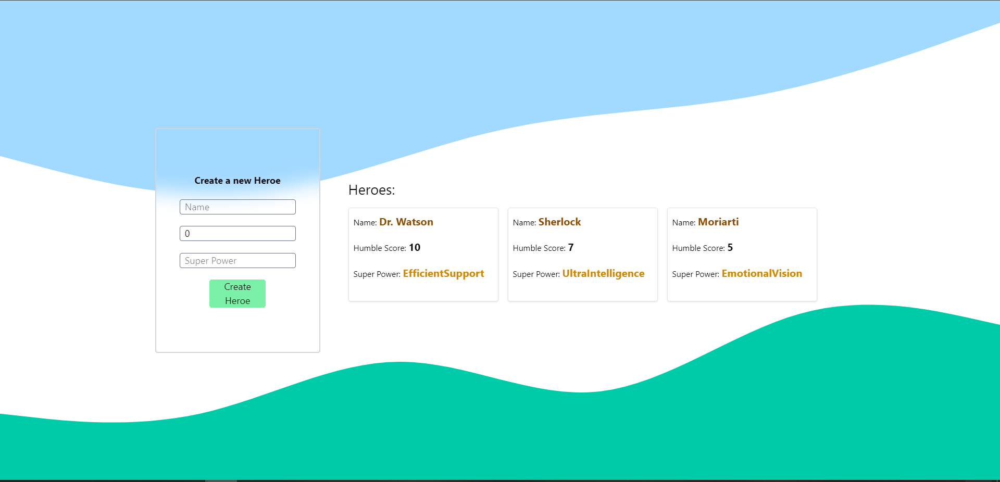

# Front end for "Humble Heroes"



## Installation

1. Clone the repository:
   ```bash
   git clone
   ```
2. Install all dependencies
   ```bash
   npm i
   ```
3. Run application
   ```bash
   npm run dev
   ```
   And then application will be ready on port 5173<br>
   Don't forget to run the back end application

## If I had more time

I would separate api calls
I would maybe worked more on ui
I would make error handling and better form validation
